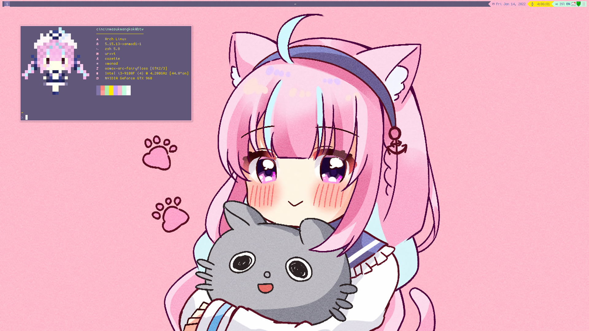
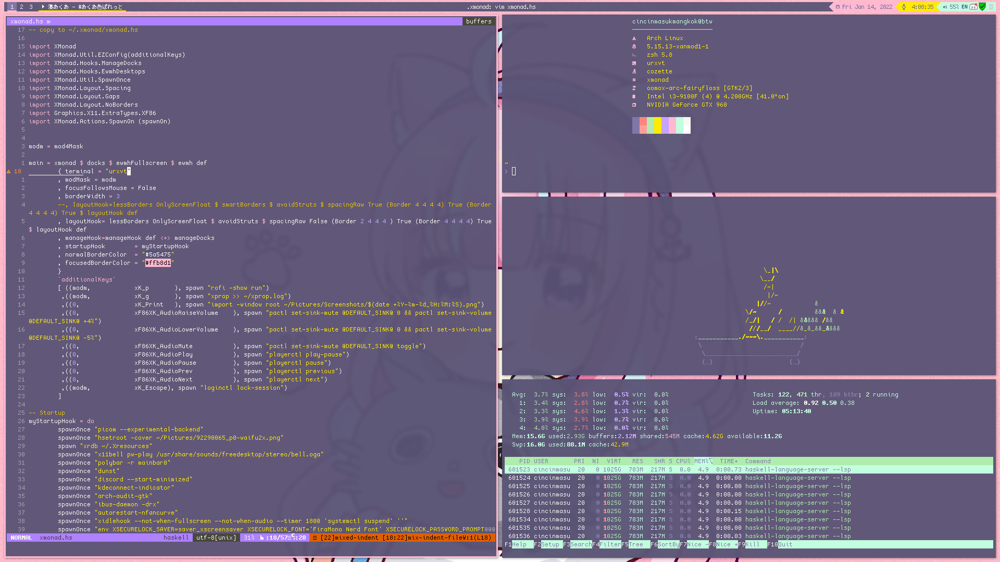

Minato Aqua
========

Requires xmonad 0.17 & xmonad-contrib 0.17

Wallpaper : [あくあちゃんまとめ⚓︎ by にいな](https://www.pixiv.net/en/artworks/92290065) \

neofetch Image : [湊あくあさん by やまだこんた](https://www.pixiv.net/en/artworks/95249650) 

vim color scheme: [fairyfloss.vim](https://github.com/tssm/fairyfloss.vim) \

Bar : [polybar](https://polybar.github.io/) \

Terminal : [urxvt (truecolor & wide glyph patch)](http://software.schmorp.de/pkg/rxvt-unicode.html) \

Terminal color scheme : [fairyfloss (aquatier's version converted to .Xresources format)](https://github.com/aquartier/fairyfloss) \
